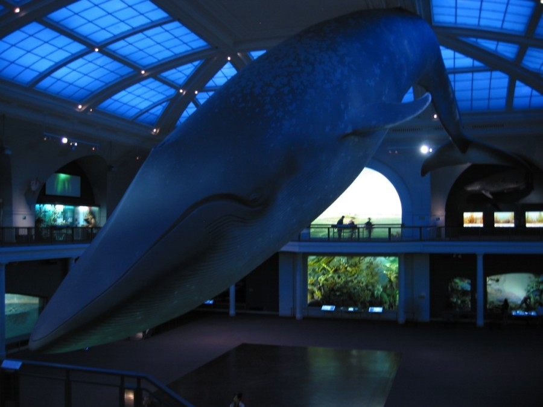
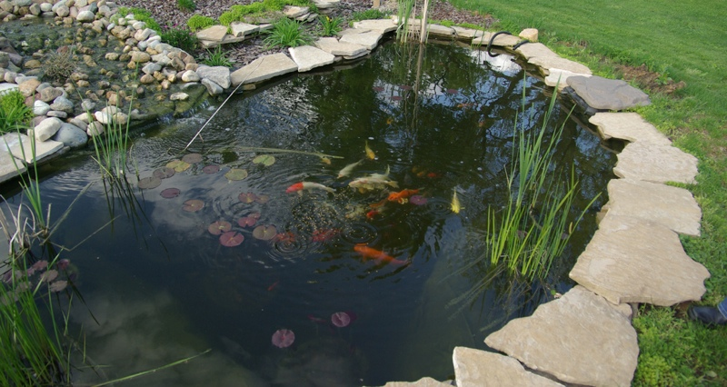
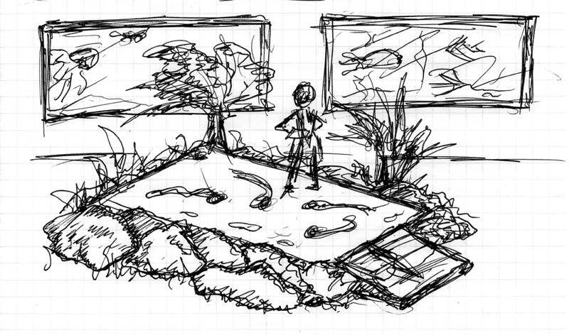

#Outro

##Thoughts on the Installation

My original concept for **artifish**, in terms of installation, was really a bit mundane, now that I think back on it: two or three large flatscreens, countersunk in a wall to emulate traditional high-end aquarium display.  I thought that if I could somehow come close to achieving the ambience of the American Museum of Natural History’s “Whale Room”, I would be happy.

Then I started thinking . . . what if we didn’t put the screen on the wall, but instead laid it flat on the floor?  We could recreate the experience of the traditional goldfish pond.  I’ve seen installations of video “walls” on the floor, so I know it’s possible . . . and by covering the screen with a durable pane of plexiglass or gorilla glass, people could walk right on the display.

I did a little googling, and found the below image, and that’s when I really had that “flash” of inspiration.  We wouldn’t just put the screen on the floor -- we’d recreate a whole Meditative Garden all around it.  

I did a quick sketch, which you can see below.  I’m completely psyched about this now!  Even if this doesn’t happen at the Barbican, I’m going to find a way to get it produced .. somewhere.  Maybe in my living room!  

We shall see.

Well I must say, it’s been a crazy couple of days . . . but well worth it.  Win or not, this has been a lot of fun.

Good luck to all!